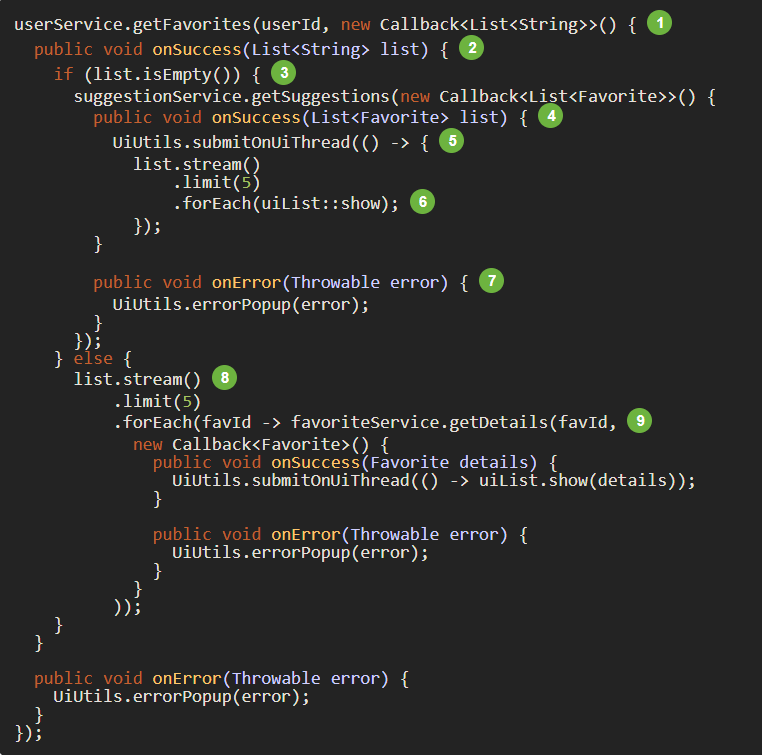
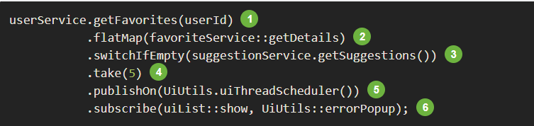
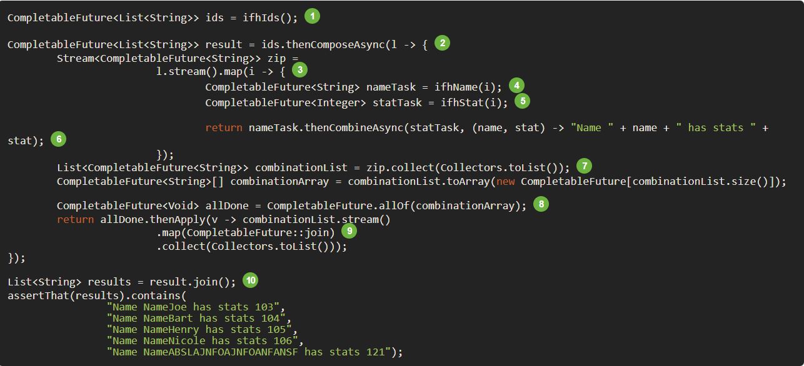
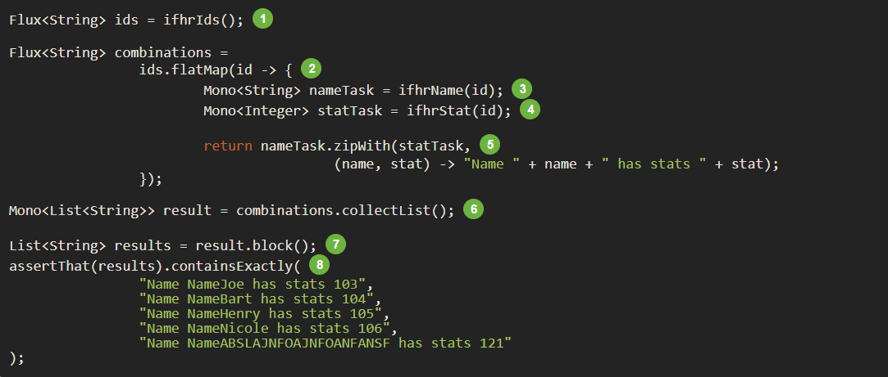
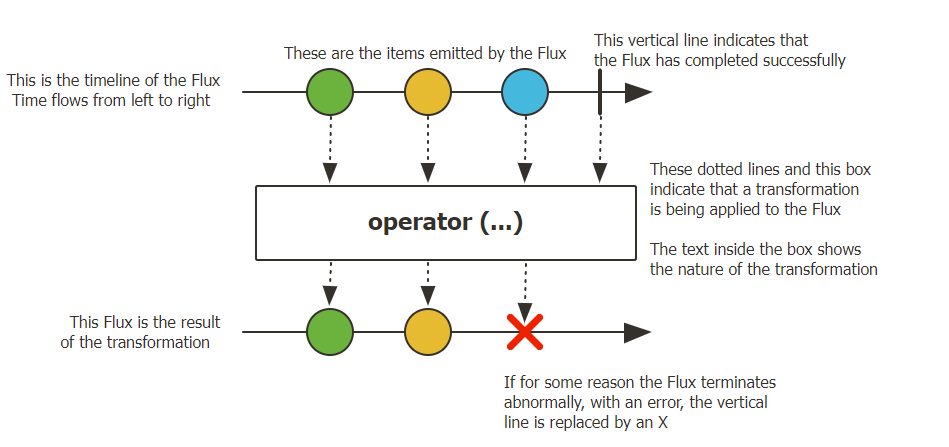
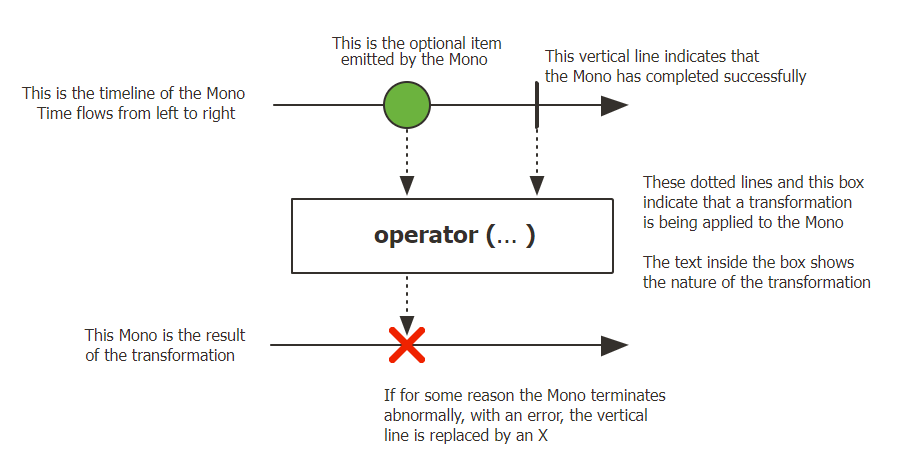

# Reactor
## IO NIO AIO
## What is Reactor?
- Reactor is a fully non-blocking reactive programming foundation for the JVM, with efficient demand management (in the form of managing “backpressure”). It integrates directly with the Java 8 functional APIs, notably CompletableFuture, Stream, and Duration. It offers composable asynchronous sequence APIs——Flux (for [N] elements) and Mono (for [0|1] elements)——and extensively implements the Reactive Streams specification.
## What is Reactive Programming?
- Reactive programming is an asynchronous programming paradigm concerned with data streams and the propagation of change. This means that it becomes possible to express static (e.g. arrays) or dynamic (e.g. event emitters) data streams with ease via the employed programming language(s).
- Some history:
    1. Microsoft created the Reactive Extensions (Rx) library in the .NET ecosystem.
    2. RxJava implemented reactive programming on the JVM.
    3. a standardization for Java emerged through the Reactive Streams effort.(Its interfaces have been integrated into Java9 under the Flow class)
## Why we need an asynchronous reactive library(Reactor)?
- Blocking can be wasteful and parallelization approach is not a silver bullet,  It is necessary to access the full power of the hardware
- By writing asynchronous, non-blocking code, you let the execution switch to another active task that uses the same underlying resources and later comes back to the current process when the asynchronous processing has finished.
#### Existed asynchronous ways java offered
- Callback
    1. hard to compose together.
    2. too much nested callback, hard to read and maintain.
-  
- 
- Future
    1. still do not do well at composition, despite the improvement brought in Java8 by CompletableFuture. Orchestrating multiple Future objects together is doable but not easy.
    2. It is easy to end up with another blocking situation with Future objects by calling the get() method.
    3. They do not support lazy computation.
    4. They lack support for multiple values and advanced error handling.
-  
- 
## From Imperative to Reactive Programming
- Composability and readability 
- Data as a flow manipulated with a rich vocabulary of operators 
- Nothing happens until you subscribe 
- Backpressure or the ability for the consumer to signal the producer that the rate of emission is too high 
- High level but high value abstraction that is concurrency-agnostic
- Hot vs Cold
## Core Features
#### Flux, an Asynchronous Sequence of 0-N Items

#### Mono, an Asynchronous 0-1 Result
